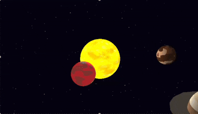

# Laboratorio 5 - Gráficas por Computadora

## Explicación del Ruido

Para la estrella (el sol) de la escena, se utilizaron dos tipos de ruido para darle una apariencia más dinámica y realista: Simplex Noise y Cellular Noise.

### Simplex Noise

El ruido Simplex es un tipo de ruido de gradiente que es computacionalmente más eficiente que el ruido Perlin tradicional. Se utilizó para generar un patrón de "manchas solares" más oscuras en la superficie del sol. Este ruido crea patrones suaves y continuos que se mueven lentamente a lo largo del tiempo, simulando la apariencia de la superficie de una estrella. El resultado del ruido Simplex se resta del color base del sol, creando regiones más oscuras que se mueven y cambian.

### Cellular Noise

El ruido celular (también conocido como Voronoi o Worley) se utiliza para crear patrones que se asemejan a células o burbujas. En este proyecto, el ruido celular se utiliza para simular las "burbujas" de plasma en la superficie del sol. El ruido genera un patrón de celdas, y la distancia al centro de la celda más cercana se utiliza para modular el color y la intensidad del sol. Las áreas más cercanas al centro de una celda son más brillantes, mientras que los bordes son más oscuros, creando un efecto de "ebullición" en la superficie.

La combinación de estos dos tipos de ruido da como resultado una apariencia visualmente interesante y dinámica para el sol, con manchas solares que se mueven lentamente y una superficie que parece estar en constante ebullición.
